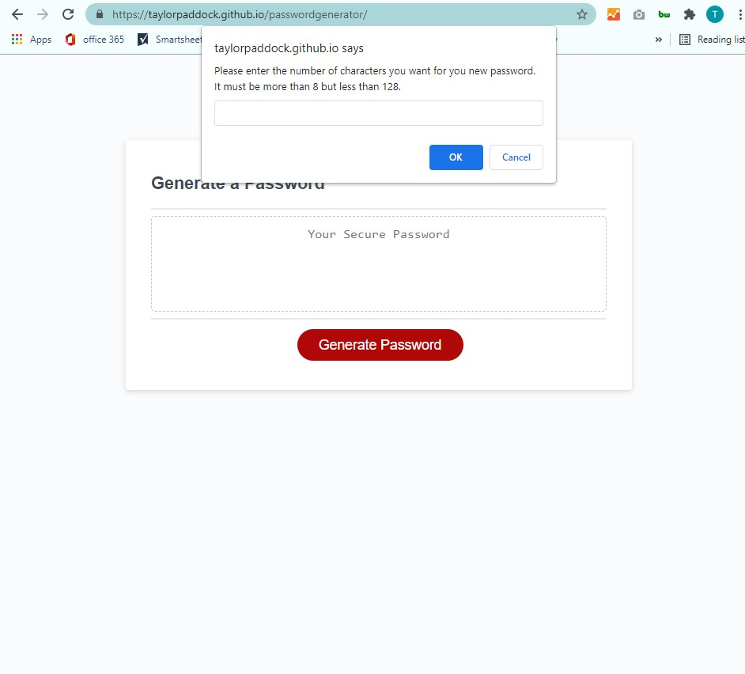

# passwordgenerator

## Description

Create a functioning password generator that asks for a character limit between 8 to 128 characters. Then prompts you to select uppercase letters, lowercase letters, numbers or symbols to be included in your password.

## Installation

Website can be accessed through my Gitlab profile.

## Usage

Website application can be viewed on all screen sizes.
link: https://taylorpaddock.github.io/passwordgenerator/

```md

```

## Credits

Used help from:
https://www.youtube.com/watch?v=duNmhKgtcsI
https://www.w3schools.com/jsref/met_win_prompt.asp
https://www.w3schools.com/jsref/met_win_confirm.asp

## How to Contribute

Update criteria to add more character types.